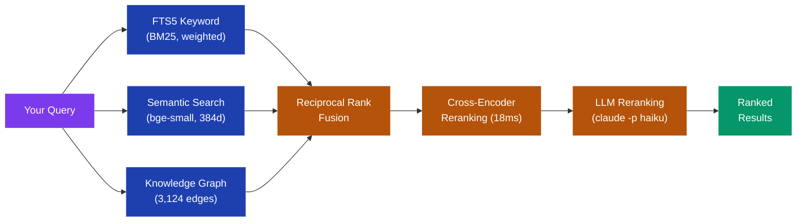
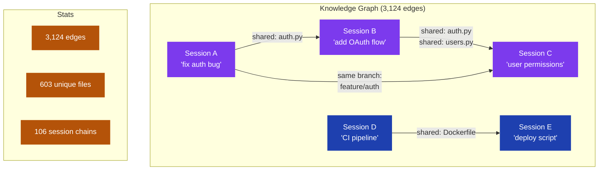
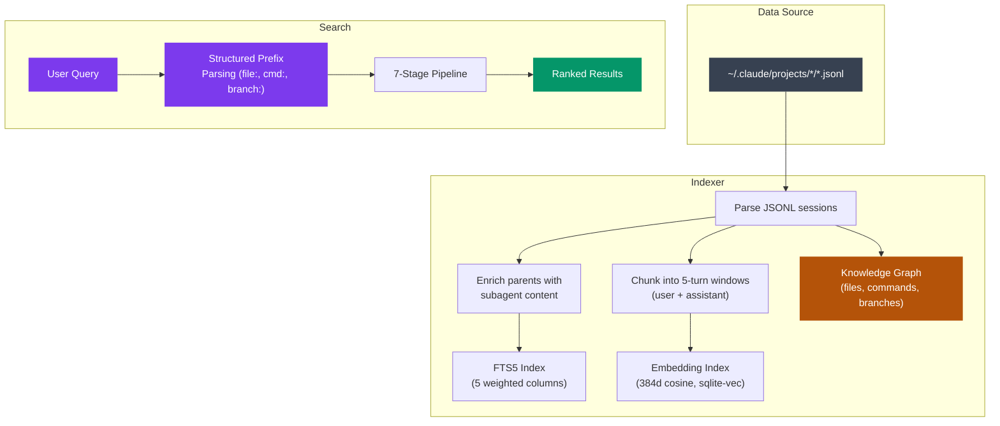

<div align="center">

# claude-recall

**Find any Claude Code session instantly.**
Semantic search with cross-encoder reranking and a knowledge graph across all your past conversations.

[](LICENSE)
[](https://python.org)
[](#development)
[](#search-quality)
[](#search-quality)
[](#knowledge-graph)

</div>

---

```bash
pip install claude-recall[all]
claude-recall "debugging the auth middleware"
```

## The Problem

You accumulate hundreds of Claude Code sessions across dozens of projects. Built-in `/resume` only shows 10 recent sessions with basic name matching. You can't find the session where you debugged that auth issue, optimized the database, or set up CI/CD.

**claude-recall** indexes all your sessions and searches them with a 6-stage pipeline — keyword matching, semantic embeddings, cross-encoder reranking, and optional LLM-powered understanding. A knowledge graph connects sessions through shared files, branches, and commands so you can trace how work flows across sessions.

## How It Works



| Stage | What it does | Speed |
|-------|-------------|-------|
| **FTS5** | BM25 keyword search across summary, prompts, messages, project path. Weighted columns (summary 5x, project 4x). Stop word filtering, prefix matching. | < 5ms |
| **Semantic** | Bi-encoder embeddings (bge-small-en-v1.5, ONNX, local). Searches 6,876 conversation chunks via sqlite-vec cosine similarity. Maps subagent matches to parent sessions. | < 20ms |
| **Knowledge Graph** | 3,124 edges connecting sessions through 603 shared files, commands, and branches. Surfaces related sessions even when text doesn't match. | < 5ms |
| **RRF Fusion** | Merges keyword + semantic + graph signals via Reciprocal Rank Fusion. Adapts weighting based on how many FTS results were found. | < 1ms |
| **Cross-Encoder** | ms-marco-MiniLM-L-6-v2 reranks top candidates with full query-document cross-attention. Much more accurate than bi-encoder similarity. | ~18ms |
| **LLM Rerank** | Enabled via `search_mode = llm`. Pipes candidates through Claude Haiku for intent understanding. | ~8s |
| **Cutoff** | Drops results below 40% of top score, but keeps same-project results. Mild depth boost for longer sessions. | < 1ms |

### The Key Insight: Subagent Content Bubbling

Claude Code spawns subagents for complex tasks. A session about building an iOS app might have 15 subagents doing the actual work. The parent session's first message might just be "let's build this."

**The real keywords live in subagent sessions.** We solve this:

1. **At index time** — Parent sessions are enriched with subagent first prompts
2. **At search time** — Semantic matches on subagent chunks map back to the parent session
3. **Orphan subagents** — Projects with no parent JSONL on disk (subagent-only) are auto-promoted so they remain searchable

This is why searching "an app that captures screenshots" finds a session whose first prompt is "let's build automations" — the subagents contain the screenshot-related content.

## Knowledge Graph

Sessions don't exist in isolation. The knowledge graph tracks relationships between sessions based on shared files, commands, and branches — building a web of connections across your entire coding history.



The knowledge graph powers two features:

- **Related sessions in the preview panel** — When you select a session, the preview panel shows other sessions that touched the same files. No text matching needed; if two sessions both edited `auth.py`, they're related.
- **Session chains** — Groups of sessions linked by project + branch + time proximity. 106 chains capture multi-session workflows like "started a feature, continued the next day, fixed a bug the day after." Chains give you the full story of a piece of work, not just individual sessions.

## Install

<details>
<summary><strong>pip (recommended)</strong></summary>

```bash
# Everything
pip install claude-recall[all]

# Or pick what you need
pip install claude-recall                  # keyword search only (zero deps)
pip install claude-recall[semantic]        # + embeddings + reranking
pip install claude-recall[tui]             # + interactive terminal UI
```
</details>

<details>
<summary><strong>uv</strong></summary>

```bash
uv tool install claude-recall --with textual --with fastembed --with sqlite-vec
```
</details>

<details>
<summary><strong>From source</strong></summary>

```bash
git clone https://github.com/lupuletic/claude-recall
cd claude-recall
uv venv && source .venv/bin/activate
uv pip install -e ".[all]"
```
</details>

## Usage

```bash
# Interactive TUI — type to search, arrows to navigate, Enter to resume
claude-recall

# Direct search
claude-recall "debugging auth middleware"
claude-recall "database migration script"
claude-recall "setting up 2 git accounts"

# Structured search prefixes
claude-recall "file:auth.py"              # find sessions that touched a specific file
claude-recall "cmd:docker build"          # find sessions that ran a specific command
claude-recall "branch:feature/oauth"      # find sessions on a specific branch

# Combine prefixes with regular queries
claude-recall "file:schema.prisma migration"
claude-recall "branch:main deploy"

# Filters
claude-recall "optimization" --project myapp
claude-recall "migration" --after 2026-01-01

# Output formats
claude-recall "query" --no-tui      # plain text
claude-recall "query" --json        # JSON for scripting
```

### Structured Search Prefixes

| Prefix | What it searches | Example |
|--------|-----------------|---------|
| `file:` | Sessions that read/wrote a specific file | `file:docker-compose.yml` |
| `cmd:` | Sessions that ran a specific command | `cmd:pytest` |
| `branch:` | Sessions on a specific git branch | `branch:feature/auth` |

Prefixes query the knowledge graph directly — no fuzzy matching, just exact lookups against the 603 tracked files, commands, and branches. Combine them with free-text queries for precise filtering.

### TUI Controls

| Key | Action |
|-----|--------|
| Type | Search as you type (debounced) |
| `↓` / `↑` | Navigate between search bar and results |
| `Enter` | Focus results / Resume selected session |
| `Ctrl+P` | Toggle preview panel |
| `Ctrl+O` | Open settings |
| `Ctrl+W` | Delete last word |
| `Cmd+⌫` | Clear entire search |
| `Esc` | Quit |

The preview panel shows session details including **related sessions** — other sessions that share files with the selected one, powered by the knowledge graph. This lets you trace work across sessions without searching.

When you resume a session, claude-recall `cd`s to the original project directory and runs `claude --resume` — you land right back where you left off.

### Settings

```bash
claude-recall config                              # view settings
claude-recall config search_mode hybrid         # keyword + semantic + reranking (default)
claude-recall config search_mode llm              # + Claude LLM reranking (best, ~10s)
claude-recall config search_mode keyword          # FTS only (fastest, no deps)
claude-recall config limit 20                     # more results
```

Or press `Ctrl+O` in the TUI for a visual settings panel with search mode, limits, and toggles.

## Search Quality

Benchmarked against 50 realistic "vague memory" queries — the kind of thing developers type when they can't remember which session they need:

| Category | Score | Description |
|----------|-------|-------------|
| Exact project names | **7/7** | "reshot", "skywatcher", "clawdbot", "grey residence" |
| Describing work done | **8/9** | "fixing bugs on marketing site", "email setup with microsoft 365" |
| Semantic / conceptual | **6/6** | "iOS app that captures screenshots", "session about telescope electronics" |
| Technology queries | **6/6** | "docker container issues", "telegram webhook setup" |
| Last message context | **2/2** | "use godaddy now", "push the latest to remote" |
| **Overall** | **29/30 (93%)** | **60ms/query average** |

Remaining failures are from sessions whose parent JSONL was never saved to disk (subagent-only projects) — a Claude Code limitation, not a search limitation.

### Index Stats

| Metric | Count |
|--------|-------|
| Sessions indexed | 2,003 |
| Conversation chunks | 6,876 |
| Projects | 79 |
| Knowledge graph edges | 3,124 |
| Unique files tracked | 603 |
| Session chains | 106 |

## Architecture



### Conversation Chunking

Sessions are split into sliding windows of 5 user+assistant turn pairs with 1-turn overlap. Both sides are included — assistant responses anchor what was actually discussed. Each chunk is embedded separately (6,591 vectors), and search returns the parent session (parent-child retrieval).

### Why Hybrid Search?

Embeddings alone miss exact matches. Searching a project name should match instantly — that's a keyword hit. Our hybrid approach:
- **Keywords** for exact terms, project names, error messages
- **Embeddings** for conceptual queries ("app that analyses screenshots")
- **Knowledge graph** for structural queries ("sessions that touched this file")
- **Cross-encoder** for precise relevance scoring
- **LLM** for understanding intent behind vague queries

## Comparison

| Feature | claude-recall | [recall](https://github.com/arjunkmrm/recall) | [search-sessions](https://github.com/sinzin91/search-sessions) | [claude-history](https://github.com/raine/claude-history) |
|---------|:---:|:---:|:---:|:---:|
| Keyword search | FTS5 + weighted BM25 | FTS5 + BM25 | ripgrep | Fuzzy |
| Semantic search | Local embeddings | - | - | - |
| Cross-encoder rerank | 18ms | - | - | - |
| LLM reranking | claude -p | - | - | - |
| Knowledge graph | 3,124 edges | - | - | - |
| Structured prefixes | file:, cmd:, branch: | - | - | - |
| Session chains | 106 chains | - | - | - |
| Related sessions | Via shared files | - | - | - |
| Subagent bubbling | Yes | - | - | - |
| Conversation chunking | 5-turn windows | Full text | - | - |
| Interactive TUI | Textual | - | - | ratatui |
| Settings UI | Ctrl+O | - | - | - |
| Auto-index hooks | SessionEnd | - | - | - |
| cd to project dir | Yes | - | - | - |
| Search accuracy | **93%** | - | - | - |
| API keys needed | No | No | No | No |

## First Run

On first run, claude-recall:
1. Builds a keyword index of all sessions (~8 seconds)
2. Shows results immediately (keyword search works right away)
3. Generates embeddings in the background (~2-3 minutes)
4. Builds the knowledge graph (files, commands, branches, session chains)
5. Auto-installs a SessionEnd hook so future sessions are indexed automatically

## Development

```bash
git clone https://github.com/lupuletic/claude-recall
cd claude-recall
uv venv && source .venv/bin/activate
uv pip install -e ".[all,dev]"
python -m pytest tests/ -q     # 282+ tests, ~1s
```

## License

MIT
